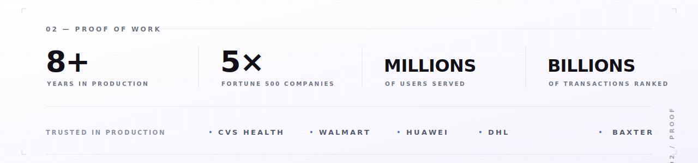

<!-- Introduction-->

<picture>
  <source media="(prefers-color-scheme: dark)" srcset="assets/hero-dark.svg">
  
</picture>

<picture>
  <source media="(prefers-color-scheme: dark)" srcset="assets/panel-proof-dark.svg">
  
</picture>

<p align="left">
  <a href="https://www.diegohurtado.com/" target="_blank"></a>
  &nbsp;
  <a href="mailto:diego.hurtado.olivares@gmail.com"></a>
  &nbsp;&nbsp;&nbsp;
  <a href="https://www.linkedin.com/in/diegohurtadoo/" target="_blank"></a>
  &nbsp;
  <a href="https://medium.com/@diego.hurtado.olivares" target="_blank"></a>
  &nbsp;
  <a href="https://www.kaggle.com/diegohurtadoo" target="_blank"></a>
</p>

<p align="right">
  <sub><b><a href="#-about-me">01&nbsp;ABOUT</a>&nbsp;&nbsp;·&nbsp;&nbsp;<a href="#-impact-at-a-glance">02&nbsp;IMPACT</a>&nbsp;&nbsp;·&nbsp;&nbsp;<a href="#-tech-stack--skills">03&nbsp;TECH&nbsp;STACK</a>&nbsp;&nbsp;·&nbsp;&nbsp;<a href="#-professional-experience">04&nbsp;EXPERIENCE</a>&nbsp;&nbsp;·&nbsp;&nbsp;<a href="#-featured-project--gemma-3-1b-reasoning-fine-tuning-with-tunix">05&nbsp;FEATURED&nbsp;PROJECT</a>&nbsp;&nbsp;·&nbsp;&nbsp;<a href="#-education">06&nbsp;EDUCATION</a></b></sub>
</p>

<br>

<!-- about me-->

<a name="-about-me"></a>

<picture>
  <source media="(prefers-color-scheme: dark)" srcset="assets/panel-about-dark.svg">
  
</picture>

<br>

<a name="-impact-at-a-glance"></a>

<picture>
  <source media="(prefers-color-scheme: dark)" srcset="assets/panel-impact-dark.svg">
  
</picture>


<!-- Stack-->

<br>

## 🛠 Tech Stack & Skills

<table align="center">
  <tr>
    <td align="center" width="22%"><strong>🧠 GenAI & ML Stack</strong></td>
    <td>
      
      
      
      
      
      
      
      
      
      
      
      
      
      
      
      
    </td>
  </tr>
  <tr>
    <td align="center"><strong>☁️ Cloud & Orchestration</strong></td>
    <td>
      
      
      
      
      
      
      
      
      
      
      
      
      
      
      
      
    </td>
  </tr>
  <tr>
    <td align="center"><strong>💻 Languages & Frameworks</strong></td>
    <td>
      
      
      
      
      
      
      
      
    </td>
  </tr>
  <tr>
    <td align="center"><strong>📚 Data & ML Libraries</strong></td>
    <td>
      
      
      
      
      
      
      
      
      
    </td>
  </tr>
  <tr>
    <td align="center"><strong>🧪 Methodologies</strong></td>
    <td>
      
      
      
      
      
    </td>
  </tr>
  <tr>
    <td align="center"><strong>📊 Data Visualization</strong></td>
    <td>
      
      
      
      
      
      
      
      
      
    </td>
  </tr>
</table>

<!-- Project-->

<br>

<div align="center">

## 🔬 Featured Project — Gemma 3 1B Reasoning Fine-Tuning with Tunix

### LoRA SFT → GRPO

**Strict XML Output Contract • Kaggle TPU–stable • Judge-ready inference wrapper**

<br>


<br><br>

<a href="https://github.com/DiegoHurtad0/gemma-tunix-production" target="_blank">
  
</a>

</div>

<br>

### 📋 Summary

<a href="https://github.com/DiegoHurtad0/gemma-tunix-production" target="_blank">
  
</a>

This project documents a **production-grade reasoning fine-tuning pipeline** for **Gemma 3 1B Instruct** using **Tunix (JAX)** on Kaggle TPUs.
The core goal is **judge robustness**: ensure the model emits a machine-parseable output schema every time:

```xml
<reasoning>...</reasoning>
<answer>...</answer>
```

- **Stage 1 — LoRA SFT:** Seeds strict XML format + instruction-following behavior.
- **Stage 2 — GRPO:** Reinforcement learning with composite rewards (format + task quality + stability).
- **Judge-safe inference wrapper:** Deterministic repair + escaping guarantees strict XML for evaluation.
- **Systems reliability:** OOM-safe GRPO defaults, KV-cache sizing guarantees, and Tunix 0.1.6 concat-safe rollout batching.
- **Evaluation harness:** Quant metrics, qualitative before/after, and TensorBoard-derived training curves.

**Languages:** &nbsp; Python

<br clear="right">

### 📊 Key Visual Evidence (from the final run)

<p align="center">
  
  
  
</p>

<p align="center">
  
  
</p>

<p align="center">
  
</p>

<br>

### ✅ Results Snapshot (Smoke Test)

> These are small-N smoke tests designed to catch regressions early (format breaks, empty outputs, instability).
> **The key win is eliminating judge-visible format failures via deterministic strict-XML repair.**

<div align="center">

| Metric | Result | Detail |
|:---|:---:|:---:|
| **Strict XML validity** (raw generation) | 🟡 **40.00%** | 8 / 20 |
| **Strict XML validity** (after deterministic repair) | 🟢 **100.00%** | 20 / 20 |
| **Math exact match** (normalized, repaired) | ⚪ **15.00%** | 3 / 20 |

</div>

<br>

### 🏗 Production-Grade Engineering

| | Practice | What it delivers |
|:---:|:---|:---|
| 📐 | **Contract-first design** | Strict output schema enforced in prompt, rewards, and inference wrapper |
| 🔧 | **Tunix 0.1.6 stability engineering** | Concat-safe rollout batching + KV-cache correctness guarantees |
| 🛡 | **OOM-safe GRPO defaults** | Conservative microbatch/generations/kv-extra to finish reliably on Kaggle TPUs |
| ⚖️ | **Judge-friendly evaluation** | Before/after tables + training curves + token budget proof |
| 🔁 | **Reproducibility** | Config-driven pipeline + deterministic inference settings (`INF_TOP_P=None` for greedy) |

<br>

<details>
<summary><h3>🧪 Extra Evaluation Artifacts (selected) — click to expand</h3></summary>
<br>

<p align="center">
  
  
</p>

<p align="center">
  
</p>

</details>

<br>

### 🏁 Challenge Summary

| Challenge / Track | Base Model | Training Strategy | Output Contract | Key Proof |
|:---|:---:|:---|:---|:---|
| **Google Tunix Hackathon** (Reasoning Traces) | Gemma 3 1B IT | LoRA SFT → GRPO (reward shaping) | Strict XML: `<reasoning>` + `<answer>` | 100% strict XML post-repair + full eval artifacts |

<br>


<!-- //////////////////////////////////////////////////////////////////////////////////////////////////////////////////////////////////////////////// //-->


<br>

<h1 align="center">Offline Multimodal Clinical Triage Copilot (MedGemma 1.5)</h1>
<h3 align="center">Evidence‑first • Offline‑first • Auditable PDF • Single T4‑class GPU</h3>

<a href="https://www.kaggle.com/code/diegohurtadoo/multimodal-clinical-reasoning-agent" target="_blank">
  
</a>

<h3 align="left">Summary</h3>

<p align="left">
<strong>FieldScribe</strong> is an <strong>offline‑first, evidence‑anchored triage copilot</strong> that:
(1) localizes chest X‑ray findings, (2) detects interval change (Δ heatmap), (3) compresses FHIR‑shaped EHR context into auditable facts, and (4) exports a clinician‑readable <strong>triage report + tamper‑evident PDF</strong>.
</p>

<ul>
  <li><strong>Offline-first:</strong> Runs on-prem / edge once weights & assets are present (no cloud dependency at inference time).</li>
  <li><strong>Evidence-first UX:</strong> Always renders images + Δ heatmap + extracted facts alongside the narrative output.</li>
  <li><strong>MedGemma-powered:</strong> Uses <strong>MedGemma 1.5 4B IT</strong> for multimodal synthesis (CXR + EHR).</li>
  <li><strong>Safety guardrails:</strong> DICOM routing interlock prevents patient mismatches from entering synthesis.</li>
  <li><strong>Auditability:</strong> Structured JSON audit packet + <strong>Unicode-safe</strong> PDF export (ReportLab).</li>
  <li><strong>Feasibility instrumentation:</strong> Logs latency, peak VRAM, and token counts (ablation table in notebook).</li>
</ul>

<br>

<h3 align="left">Check it here</h3>

<a href="https://github.com/DiegoHurtad0" target="_blank">
  
</a>

<a href="https://www.kaggle.com/code/diegohurtadoo/multimodal-clinical-reasoning-agent" target="_blank">
  
</a>

<a href="https://youtu.be/dl6Aq4TugQk" target="_blank">
  
</a>

<br>
<br>

<h3 align="left">Languages</h3>

<br>
<br>

<h3 align="left">GenAI / ML Stack</h3>


<br>
<br>

<h3 align="left">Key Visual Evidence (from the final run)</h3>

<p align="center">
  
  
  
</p>

<p align="center">
  
  
</p>

<br>

<h3 align="left">Impact Snapshot</h3>

<ul>
  <li><strong>Time saved per complex triage case:</strong> ~10–14 minutes (manual EHR review + prior comparison + note drafting → evidence-first workflow).</li>
  <li><strong>Capacity reclaimed (example):</strong> 40 cases/day × 10 min/case ≈ <strong>6.7 clinician hours/day</strong> returned to care.</li>
  <li><strong>Access + privacy:</strong> Enables multimodal assistance in bandwidth-limited or sovereignty-restricted settings.</li>
</ul>

<br>

| Challenge / Track | Base Model | Deployment Target | Evidence / Audit Artifacts | Key Proof |
|------------------|-----------:|------------------|----------------------------|----------|
| Kaggle MedGemma Impact Challenge | MedGemma 1.5 4B IT | Single T4‑class GPU (edge) | Δ heatmap + fact bullets + JSON audit + PDF | Offline-first, evidence-anchored triage workflow |

<br>

<!-- //////////////////////////////////////////////////////////////////////////////////////////////////////////////////////////////////////////////// //-->

---

# Why this project matters (Problem : Product)

In many clinical environments, the bottleneck isn’t “can AI answer medical questions?” — it’s **last‑mile triage under severe operational constraints**:

- **Intermittent connectivity:** rural clinics, mobile units, disaster response, overcrowded EDs can’t rely on cloud uptime.
- **Strict data sovereignty:** PHI often cannot leave the site or cross borders.
- **Fragmented evidence:** images, EHR facts, and priors exist — but clinicians must fuse them under intense time pressure.

FieldScribe targets a concrete workflow: **longitudinal chest X‑ray (CXR) interval change triage** where a clinician must:
1) detect what changed,  
2) localize it,  
3) reconcile with EHR context, and  
4) write an auditable note.

> **Status:** Research / demo prototype.  
> **Safety:** Not a medical device. Outputs require clinician verification.

---

## Demo visuals (place these under `assets/`)

This README expects the following files under `assets/`:

- `Multimodal_Triage.jpeg`
- `Clinical_Pipeline_Architecture.png`
- `Multimodal_Triage_Dashboard.png`
- `Agent_Demo.jpeg`
- `Longitudinal_CXR_Delta_Heatmap.png`
- `Safety_Guardrails_and_Audit_Trace.jpeg`
- `Auditable_Clinical_Summary_Report.pdf`

### Edge vs Cloud (why offline-first)


### 4‑step pipeline overview


### Offline dashboard UI (Gradio)


### Evidence panel (baseline → localization → delta heatmap)


### Fact filtering (EHR context compression)


### Safety routing + audit posture (DICOM interlock)


### Sample output artifact (PDF)

➡️ **Download the example PDF:** [Auditable_Clinical_Summary_Report.pdf](https://github.com/DiegoHurtad0/Offline-Multimodal-Clinical-Triage-Powered-by-MedGemma/blob/main/assets/Auditable_Clinical_Summary_Report.pdf)

---

## What I built (Recruiter‑focused)

### 1) Data ingestion + Fact Filtering (EHR)
- Accepts an **offline FHIR‑shaped EHR bundle** (JSON).
- Runs a **Fact Filter** stage that compresses dense EHR into **query‑relevant bullet facts** (non‑inventive, audit‑friendly).
- Goal: keep the LLM context window **clean**, reduce hallucinations, preserve traceability.

### 2) Visual comparison + Δ heatmap (CXR)
- Computes an **interval change heatmap** (current vs prior CXR).
- Produces a visual evidence panel clinicians can inspect immediately (value even before text generation).

### 3) MedGemma multimodal synthesis (AI reasoning engine)
- Uses **MedGemma 1.5 4B IT** as the multimodal model for:
  - longitudinal imaging review
  - anatomical localization / grounding
  - EHR‑informed synthesis
- Runs **deterministic inference** (`do_sample=False`) for reproducibility; optionally exposes a “glass‑box” trace in the UI.

### 4) Triage report + PDF export (paper trail)
- Generates an executive triage summary and a **FHIR‑shaped audit packet**.
- Exports a **Unicode‑safe PDF** (ReportLab) with evidence images, trace metadata, and disclaimers.

---

## Engineering highlights

- **Offline‑first design:** works without external service calls once weights/assets are present.
- **Run‑all notebook reproducibility:** deterministic settings + auto‑reset YAML config pattern.
- **Safety interlock:** DICOM header routing prevents mismatched patient context from entering synthesis.
- **Performance instrumentation:** captures latency, output tokens, and peak VRAM across ablations.
- **Clinician-style UX:** evidence surfaced alongside narrative output.

---

## Performance & feasibility

- Target: **single Tesla T4‑class GPU** (edge deployable).
- Includes:
  - **Warmup** after model load to reduce first‑click latency spikes.
  - **Fast Mode** to cap tokens / reduce context while preserving evidence‑first outputs.
  - **Ablation table** logging: latency (s), output tokens, peak VRAM (MB)

> Example observed in demo screenshot: **Peak VRAM during visualization ≈ 3092 MB** (heatmap + panel rendering).  
> Exact measurements depend on runtime + model caching; see the notebook’s feasibility section.


---

## Disclaimer

FieldScribe is a demonstration prototype. It is **not** a regulated medical device and **must not** be used for definitive diagnosis or treatment decisions. Always defer to qualified clinical judgment and local protocols.


<!-- //////////////////////////////////////////////////////////////////////////////////////////////////////////////////////////////////////////////// //-->

<br>

<br>


<br>
<h1 align="center" href="https://medium.com/@diego.hurtado.olivares/linear-regression-from-scratch-15bfd15dc2e" > Linear Regression Model Representation & Implementation From Scratch in Python </h1>

<a href="https://www.kaggle.com/code/diegohurtadoo/house-price-prediction-top-12-leaderboard" target="blank"></a>

<h3 align="left">Summary:</h3>
Linear Regression Model Representation & Implementation From Scratch using Python
<h3 align="left">Check it here:</h3>
<a href="https://www.kaggle.com/code/diegohurtadoo/house-price-prediction-top-12-leaderboard" target="blank"></a>
<a href="https://medium.com/@diego.hurtado.olivares/linear-regression-from-scratch-15bfd15dc2e" target="blank"></a>
<br>
</p>
 
<h3 align="left">Languages:</h3>
<a href="" target="blank"></a>
<br>
</p>
<h3 align="left">Data Science Tools:</h3>
 </a> <a href="" target="_blank" rel="noreferrer">
 </a> <a href="" target="_blank" rel="noreferrer"> 
 </a> <a href="" target="_blank" rel="noreferrer">
 </a> <a href="" target="_blank" rel="noreferrer">

<h3 align="left">Data Visualization Tools: </h3>
 </a> <a href="" target="_blank" rel="noreferrer">
 </a> <a href="" target="_blank" rel="noreferrer"> 
 </a> <a href="" target="_blank" rel="noreferrer">
 </a> <a href="" target="_blank" rel="noreferrer"> 

<br>
<br>
 
 
| Challenge           | Models                | Ranking        | People Ranking   |
|---------------------|-----------------------|----------------|---------|
| House Price Prediction | Stacking Models   | Top 3%        |   Top 97 /  4651 |
| House Price Prediction | XGBoost, LightGBM    | Top 12%        |     |
 
 
 
 <br>

<!-- //////////////////////////////////////////////////////////////////////////////////////////////////////////////////////////////////////////////// //-->


<br>

<br>
 
 <h1 align="center" href="https://medium.com/p/b088390ce0f0" > Customer Churn Prediction Using Machine Learning Models: </h1>

<p>
  <a href="[https://medium.com/p/b088390ce0f0](https://github.com/DiegoHurtad0/DataSciencePortfolio/tree/main/Churn_Prediction)"></a>
</p>

<h3 align="left">Summary:</h3>
 
▪️ Predict whether a customer will churn using machine learning models

<h3 align="left">Check it here:</h3>
<a href="https://www.kaggle.com/code/diegohurtadoo/telco-churn-prediction-using-lstm-96-accuracy" target="blank"></a>
<a href="https://medium.com/p/b088390ce0f0" target="blank"></a>
<br>
<h3 align="left">Languages:</h3>
<a href="" target="blank"></a>
<br>
<h3 align="left">Data Science Tools:</h3>
 </a> <a href="" target="_blank" rel="noreferrer">
 </a> <a href="" target="_blank" rel="noreferrer"> 
 </a> <a href="" target="_blank" rel="noreferrer">
<h3 align="left">Data Visualization Tools: </h3>
 </a> <a href="" target="_blank" rel="noreferrer">
 </a> <a href="" target="_blank" rel="noreferrer">
 </a> <a href="" target="_blank" rel="noreferrer"> 
<br>
<br>
<br>
 
| Challenge                | Models       | Score | Link                                              |
|--------------------------|--------------|-------|---------------------------------------------------|
| Custumer Churn Prediction   | LSTM         | 96%   | [Repository]([https://github.com/username/repo1](https://www.kaggle.com/code/diegohurtadoo/telco-churn-prediction-using-lstm-96-accuracy))   |
| Telco Customer Churn     | LSTM         | 81%   | [Repository]([https://github.com/username/repo2](https://www.kaggle.com/code/diegohurtadoo/custumer-churn-prediction-lstm-81-accuracy))   |
 
 
 
 <!-- //////////////////////////////////////////////////////////////////////////////////////////////////////////////////////////////////////////////// //-->

<br>
<h1 align="center" href="https://medium.com/@diego.hurtado.olivares/predicting-taxi-fare-in-new-york-city-c5dd4aef55f4" > Predict Taxi Fare in NY using Machine Learning Techniques </h1>

<a href="https://medium.com/@diego.hurtado.olivares/predicting-taxi-fare-in-new-york-city-c5dd4aef55f4" target="blank"></a>

<h3 align="left">Summary:</h3>
Linear Regression Model Representation & Implementation From Scratch using Python
<h3 align="left">Check it here:</h3>
<a href="https://medium.com/@diego.hurtado.olivares/predicting-taxi-fare-in-new-york-city-c5dd4aef55f4" target="blank"></a>
<br>
</p>
 
<h3 align="left">Languages:</h3>
<a href="" target="blank"></a>
<br>
</p>
<h3 align="left">Data Science Tools:</h3>
 </a> <a href="" target="_blank" rel="noreferrer">
 </a> <a href="" target="_blank" rel="noreferrer"> 
 </a> <a href="" target="_blank" rel="noreferrer">
 </a> <a href="" target="_blank" rel="noreferrer">

<h3 align="left">Data Visualization Tools: </h3>
 </a> <a href="" target="_blank" rel="noreferrer">
 </a> <a href="" target="_blank" rel="noreferrer"> 
 </a> <a href="" target="_blank" rel="noreferrer">
 </a> <a href="" target="_blank" rel="noreferrer"> 
<br>

<!-- //////////////////////////////////////////////////////////////////////////////////////////////////////////////////////////////////////////////// //-->

<h1 align="center" href="https://medium.com/towards-data-science/covid-19-an-overview-of-mexico-ccf702ec80d9/" > Data analysis of covid in Mexico: </h1>

<p>
  <a href="https://medium.com/towards-data-science/covid-19-an-overview-of-mexico-ccf702ec80d9"></a>
</p>

<h3 align="left">Summary:</h3>
 
▪️ Covid 19 — Data Analyst Mexico Overview
 
▪️ Explanation model of death cases in Mexico
 
▪️ Mexico Counties Covid Cases Correlation
 
▪️ Mexico`s Mobility pattern behaviour
 
▪️ Mexico Counties Clustering
<h3 align="left">Check it here:</h3>
<a href="https://medium.com/towards-data-science/covid-19-an-overview-of-mexico-ccf702ec80d9" target="blank"></a>
<br>
<h3 align="left">Languages:</h3>
<a href="" target="blank"></a>
<br>
<h3 align="left">Data Science Tools:</h3>
 </a> <a href="" target="_blank" rel="noreferrer">
 </a> <a href="" target="_blank" rel="noreferrer"> 
 </a> <a href="" target="_blank" rel="noreferrer">
<h3 align="left">Data Visualization Tools: </h3>
 </a> <a href="" target="_blank" rel="noreferrer">
 </a> <a href="" target="_blank" rel="noreferrer">
 </a> <a href="" target="_blank" rel="noreferrer"> 
<br>

<!-- //////////////////////////////////////////////////////////////////////////////////////////////////////////////////////////////////////////////// //-->
 

<h1 align="center" href="https://medium.com/towards-data-science/covid-19-coronavirus-top-ten-most-affected-countries-c165171c50d7" > Data Analysis of the COVID-19 pandemic in North America </h1>


<a href="https://medium.com/towards-data-science/covid-19-coronavirus-top-ten-most-affected-countries-c165171c50d7" target="blank"></a>

<h3 align="left">Summary:</h3>
An in-depth look at the spread of covid-19 in North America

<h3 align="left">Check it here:</h3>
<a href="https://medium.com/towards-data-science/covid-19-coronavirus-top-ten-most-affected-countries-c165171c50d7" target="blank"></a>
<br>
<h3 align="left">Languages:</h3>
<a href="" target="blank"></a>
<a href="" target="blank"></a>
</p>

  
<h3 align="left">Data Science Tools:</h3>

 </a> <a href="" target="_blank" rel="noreferrer">
 </a> <a href="" target="_blank" rel="noreferrer"> 
 </a> <a href="" target="_blank" rel="noreferrer">
 </a> <a href="" target="_blank" rel="noreferrer">


<h3 align="left">Data Visualization Tools: </h3>

 </a> <a href="" target="_blank" rel="noreferrer">
 </a> <a href="" target="_blank" rel="noreferrer"> 
 </a> <a href="" target="_blank" rel="noreferrer">
 </a> <a href="" target="_blank" rel="noreferrer"> 
 
 <!-- //////////////////////////////////////////////////////////////////////////////////////////////////////////////////////////////////////////////// //-->
 
<h1 align="center" href="https://github.com/DiegoHurtad0/Data-Exploration-on-Amsterdam-Airbnb" > Data Exploration on Amsterdam Airbnb </h1>


<a href="https://medium.com/towards-data-science/covid-19-coronavirus-top-ten-most-affected-countries-c165171c50d7" target="blank"></a>

<h3 align="left">Summary:</h3>
Data Exploration on Amsterdam Airbnb

<h3 align="left">Check it here:</h3>
<a href="https://github.com/DiegoHurtad0/Data-Exploration-on-Amsterdam-Airbnb" target="blank"></a>
<br>
<h3 align="left">Languages:</h3>
<a href="" target="blank"></a>
<a href="" target="blank"></a>
</p>

  
<h3 align="left">Data Science Tools:</h3>

 </a> <a href="" target="_blank" rel="noreferrer">
 </a> <a href="" target="_blank" rel="noreferrer"> 
 </a> <a href="" target="_blank" rel="noreferrer">
 </a> <a href="" target="_blank" rel="noreferrer">


<h3 align="left">Data Visualization Tools: </h3>

 </a> <a href="" target="_blank" rel="noreferrer">
 </a> <a href="" target="_blank" rel="noreferrer"> 
 </a> <a href="" target="_blank" rel="noreferrer">
 </a> <a href="" target="_blank" rel="noreferrer"> 
 
 <!-- //////////////////////////////////////////////////////////////////////////////////////////////////////////////////////////////////////////////// //-->

<h1 align="center" href="https://github.com/DiegoHurtad0/USA-Traveling-Salesman-Tour" > Traveling Salesperson Problem </h1>


<a href="https://medium.com/towards-data-science/covid-19-coronavirus-top-ten-most-affected-countries-c165171c50d7" target="blank"></a>

<h3 align="left">Summary:</h3>
Efficient route planning for travelling salesman problem for 48 USA States

<h3 align="left">Check it here:</h3>
<a href="https://medium.com/towards-data-science/covid-19-coronavirus-top-ten-most-affected-countries-c165171c50d7" target="blank"></a>
<br>
<h3 align="left">Languages:</h3>
<a href="" target="blank"></a>
<a href="" target="blank"></a>
</p>

  
<h3 align="left">Data Science Tools:</h3>

 </a> <a href="" target="_blank" rel="noreferrer">
 </a> <a href="" target="_blank" rel="noreferrer"> 
 </a> <a href="" target="_blank" rel="noreferrer">
 </a> <a href="" target="_blank" rel="noreferrer">


<h3 align="left">Data Visualization Tools: </h3>

 </a> <a href="" target="_blank" rel="noreferrer">
 </a> <a href="" target="_blank" rel="noreferrer"> 
 </a> <a href="" target="_blank" rel="noreferrer">
 </a> <a href="" target="_blank" rel="noreferrer"> 
 
 <!-- //////////////////////////////////////////////////////////////////////////////////////////////////////////////////////////////////////////////// //-->
 
 
 
 <h1 align="left"> Machine Learning Regression Models From Scratch in Python </h1>
 

<a href="https://github.com/DiegoHurtad0/Linear-Regression-Model-Representation-Implementation-From-Scratch-using-Python" target="blank"></a>

<h3 align="left">Summary:</h3>

▪️ XGBoostRegressor
 
▪️ RandomForestRegressor
 
▪️ DecisionTreeRegressor
 
<h3 align="left">Check it here:</h3>
<a href="https://github.com/DiegoHurtad0/Linear-Regression-Model-Representation-Implementation-From-Scratch-using-Python" target="blank"></a>
<a href="https://medium.com/@diego.hurtado.olivares/linear-regression-from-scratch-15bfd15dc2e" target="blank"></a>
<br>
</p>
 
<h3 align="left">Languages:</h3>
<a href="" target="blank"></a>
<br>
</p>
<h3 align="left">Data Science Tools:</h3>
Numpy
 </a> <a href="" target="_blank" rel="noreferrer">

<br>
<br>
<!-- //////////////////////////////////////////////////////////////////////////////////////////////////////////////////////////////////////////////// //-->

 <h1 align="left"> Machine Learning Classifiers Models From Scratch in Python </h1>
 

<a href="https://github.com/DiegoHurtad0/Linear-Regression-Model-Representation-Implementation-From-Scratch-using-Python" target="blank"></a>

<h3 align="left">Summary:</h3>
▪️ Long Short-Term Memory (LSTM) Classifier
 
<h3 align="left">Check it here:</h3>
<a href="https://github.com/DiegoHurtad0/Linear-Regression-Model-Representation-Implementation-From-Scratch-using-Python" target="blank"></a>
<br>
</p>
 
<h3 align="left">Languages:</h3>
<a href="" target="blank"></a>
<br>
</p>
<h3 align="left">Data Science Tools:</h3>
Numpy
 </a> <a href="" target="_blank" rel="noreferrer">

<br>
<br>
<!-- //////////////////////////////////////////////////////////////////////////////////////////////////////////////////////////////////////////////// //-->

<br>
<h1 align="center" href="https://medium.com/towards-data-science/make-a-covid-19-choropleth-map-in-mapbox-5c93ac86e907"> Covid 19 Choropleth Map </h1>
<p>
  <a href="https://github.com/DiegoHurtad0/Covid-19-Choropleth-Map"></a>
</p>
▪️ How to Make a Covid-19 Choropleth Map in Mapbox
<h3 align="left">Check it here:</h3>
<a href="https://github.com/DiegoHurtad0/Covid-19-Choropleth-Map" target="blank"></a>
<a href="https://medium.com/towards-data-science/make-a-covid-19-choropleth-map-in-mapbox-5c93ac86e907" target="blank"></a>
<br>
<h3 align="left">Languages:</h3>
<a href="" target="blank"></a>
<br>
<h3 align="left">Data Visualization Tool:</h3>
 </a> <a href="" target="_blank" rel="noreferrer">

<!-- //////////////////////////////////////////////////////////////////////////////////// //-->

<br>
<br>
<br>
<br>
<br>
<br>


